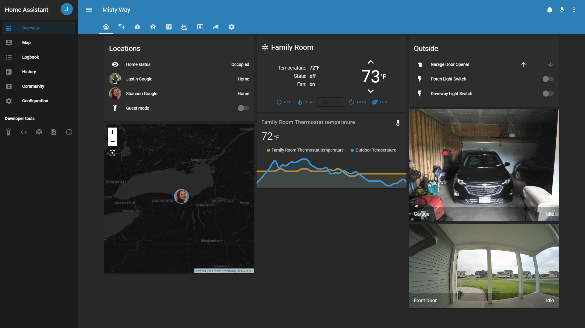
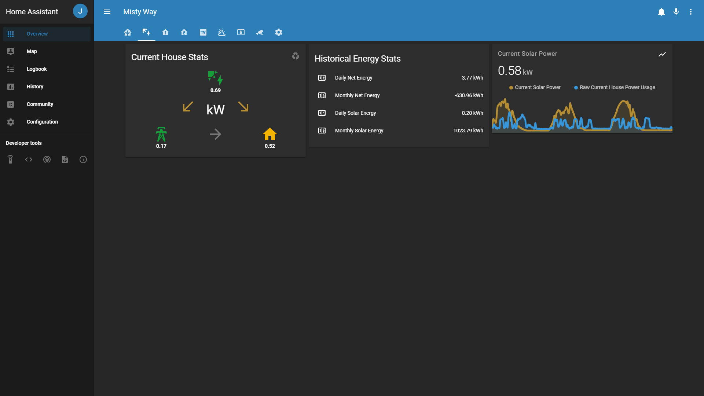
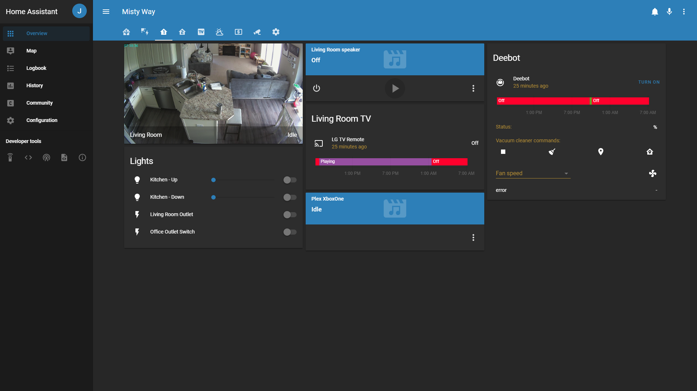
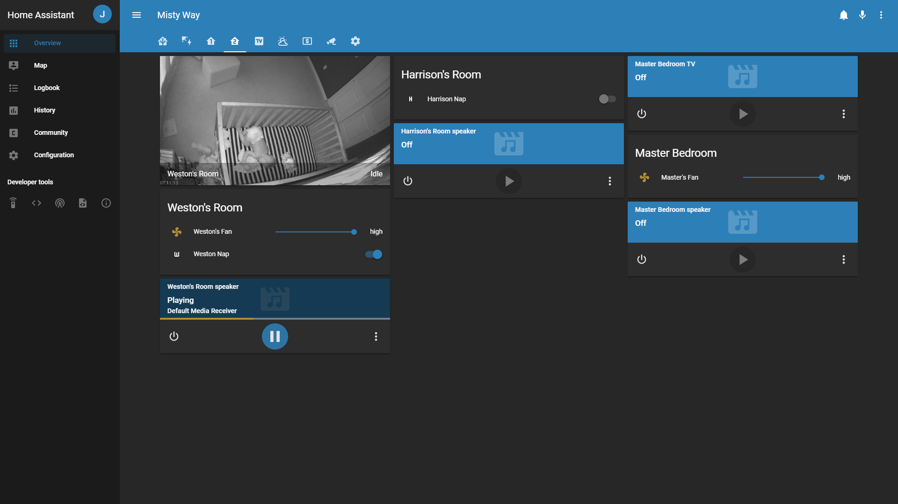

# Home Assistant Configuration
This is the configuration for my home instance of [Home Assistant](https://www.home-assistant.io/).

# Screenshots
## Main Screen

## Solar

## First Floor

## Second Floor

# Notable Custom Cards/Components
Here are a few of the notable custom integrations in use for my setup. 
* [HACS](https://github.com/custom-components/hacs)
  * An embedded way to manage many cards and components.
  * Built in monitoring for updates and updating.
* Cards that make things look good
  * [Simple Thermostat](https://github.com/nervetattoo/simple-thermostat)
  * [Lovelace Layout Card](https://github.com/thomasloven/lovelace-layout-card)
    * Used to force certain column layouts
  * [Lovelace More Info Card](https://github.com/thomasloven/lovelace-more-info-card)
    * Lets you use the detailed info of a card as a card.
  * [Lovelace Slider Entity Row](https://github.com/thomasloven/lovelace-slider-entity-row)
* Media Managment
  * [Plex Recently Added](https://github.com/custom-components/sensor.plex_recently_added)
  * [Radarr Upcoming Media](https://github.com/custom-components/sensor.radarr_upcoming_media)
  * [Sonarr Upcoming Media](https://github.com/custom-components/sensor.sonarr_upcoming_media)
  * [Upcoming Media Card](https://github.com/custom-cards/upcoming-media-card)
* Finance Monitoring
  * [Personal Capital](https://github.com/custom-components/sensor.personalcapital)
  * [PC Card](https://github.com/custom-cards/pc-card)

# Hardware
### Server
My instance of Home Assistant is running as a docker container on my home [Unraid](https://unraid.net/) server.  This server is the core to my home network, running all of the following:
* [Plex](https://www.plex.tv/)
* [Sonarr](https://sonarr.tv/)
* [Radarr](https://radarr.video/)
* [Lidarr](https://lidarr.audio/)
* [Lazy Librarian](https://github.com/lazylibrarian/LazyLibrarian)
* [SABnzbd](https://sabnzbd.org/)
* [nzbHydra2](https://github.com/theotherp/nzbhydra2)
* [MariaDB](https://mariadb.org/)
* [VS Code](https://coder.com/)

### Devices
#### Wyze Cam V2
[Product URL](https://www.wyze.com/product/wyze-cam-v2/)

These are the cameras on the inside of the house.  They are running [Dafang-Hacks](https://github.com/EliasKotlyar/Xiaomi-Dafang-Hacks) custom firmware.
#### Amcrest Doorbell
[Product URL](https://amcrest.com/smarthome-2-megapixel-wireless-doorbell-security-camera-1920-x-1080p-wifi-doorbell-camera-ip55-weatherproof-two-way-audio-ad110.html)

